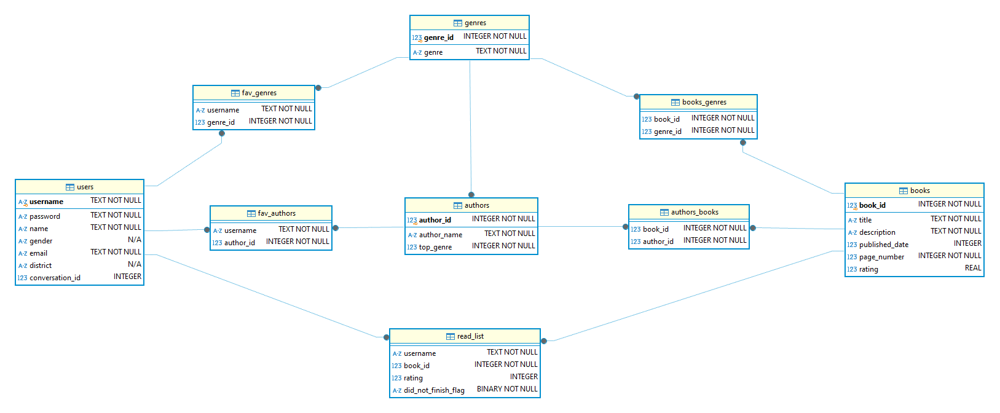
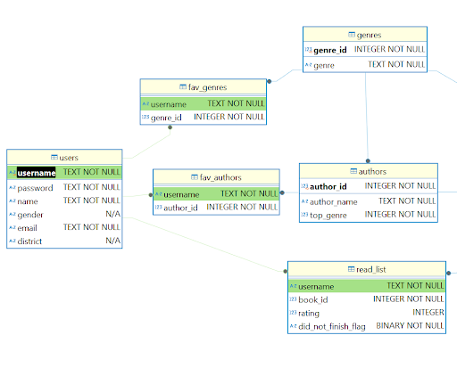

# ShelfMate


## 1. Project Overview

- **Company Name**: ShelfMate
- **Group 11**:   
-Adriana Pinto | 20221921  
-Miguel Nascimento | 20221876  
-David Duarte | 20221899  
-Marta Alves | 20221890  
-Maria Teresa Silva | 20221821  
-Inês Mendes | 20211624  
- **Description**:  
    ShelfMate is an innovative book recommendation platform, created in 2024, designed to foster a love for reading by offering highly personalized suggestions based on user preferences, moods, and goals. Using advanced AI and natural language processing, the chatbot engages in dynamic conversations, providing real-time book, author, and genre recommendations tailored to individual tastes. Key features include profile management, the ability to track books with a read list that shows whether a book is in progress, completed, or unfinished, along with options to rate them, and customizable reading plans. Users can explore specific genres, search for books by genres or tropes, and discover bookstores. ShelfMate aims to make book discovery seamless, efficient, and enjoyable, empowering readers to uncover new stories that resonate with their unique interests.


---

## 2. How to Test the Chatbot

### 2.1 Prerequisites

- **Python Version**: [Specify required version of Python]
- **Dependencies**:  
  List all the required libraries and frameworks.
- **Environment Setup**:  
  Instructions for setting up the environment, such as creating a virtual environment or conda environment.

### 2.2 How to Run the Chatbot

Provide a clear, step-by-step guide on how to launch and interact with the chatbot. Include any necessary commands, parameters, or configurations. Groups should provide information of an existing user so i can test the chatbot using information of that user, i will also test the registration process.

## 3. Database Schema

### 3.1 Database Overview and Schema Diagram

The database schema for our chatbot consists of 9 tables and was created automatically with DBeaver by importing the .db file obtained from the sqlite script.



**Primary keys** are identified in bold and foreign keys were defined on the script and are as follows:
 - fav_genres(username), favorite_authors(username) and read_list(username) reference users(username).
 - fav_genres(genre_id), authors(top_genre), books_genres(genre_id) reference genres(genre_id).
 - fav_authors(author_id), authors_books(author_id) reference authors(author_id).
 - books_genres(book_id), authors_books(book_id), read_list(book_id) reference books(book_id).



Example of foreign keys of username in DBeaver.

**Relationships**  
By using junction/bridge tables to solve cases with books with multiple authors or genres, or allowing users to have more than one favorite author or genre, every relationship in this schema is a One-to-Many relationship, instead of having Many-to-Many relationships. 


### 3.2 Table Descriptions

 - **Users:** The users table is essential for a personalized experience, secure authentication,
 and understanding user preferences. This includes storing details like username, password,
 gender, email, and district, which helps tailor content and recommendations.
 
 - **Genres:** The genres table is a reference table that matches an id to all available book
 genres, serving as a baseline to other 3 tables. It plays a key role in content organization
 and search functionality.

 - **Books:** The books table is at the core of the database, storing information like title,
 description, publication date, and page number (the latter generated artificially). It facilitates
 efficient book discovery and enables analysis of the book catalog.
 
 - **Authors:** This table contains information about authors, including their names and their
 primary genre (extracted from the books dataset), supporting better content categorization
 and author-specific recommendations for users.
 
 - **Favorite Authors:** The favorite authors table links users to their preferred authors, helping
 track user interests and enabling personalized content suggestions based on author
 preferences.
 
 - **Favorite Genres:** This table associates users with their preferred genres, allowing the
 system to recommend books and authors that match their interests and enhance their
 overall experience.

 - **Books_Genres:** Books are linked to their respective genres through this table (supporting
 multi-genre books), ensuring accurate categorization and making it easier to search for
 books within a specific genre.

 - **Authors_Books:** This table connects authors with the books they have written (supporting
 multi-author books), helping track bibliographies and supporting author-specific searches
 and recommendations.

 - **Read List:** The read list tracks the books a user has interacted with, storing data on user
 ratings and whether a book was finished. This enables the system to improve
 recommendation algorithms and understand user behavior

---

## 4. User Intentions

### 4.1 Implemented Intentions

ShelfMate's chatbot is designed to handle:

- **Updatde Profile Information**: User intends to update profile details, such as username, password, email, or district. 
- **Insert New Favourite Author or Genre**: User requests to add new favorite authors or genres to their profile.
- **Add a Book to Read List**: User wants to add books to their Read List and rate them.
- **Suggest New Authors Based on User's Favourite Books, Genres or Authors**: User requests author suggestions, and the chatbot uses their favorite books, genres, and authors to provide recommendations.
- **Suggest New Authors Based on a Specific Book, Author, or Genre**: User requests author suggestions, and the chatbot relies on a specific book, genre, or author provided by the user.
- **Suggest New Books Based User's Favourite Books, Genres or Authors**: User requests book suggestions, and the chatbot uses their favorite books, genres, and authors to recommend options.
- **Suggest New Books Based on a Specific Book, Author, or Genre**: User requests book suggestions, and the chatbot relies on a specific book, genre, or author provided by the user.
- **Suggest New Books Based on a Specific Trope**: User requests book suggestions, and the chatbot uses the provided trope to recommend books.
- **Browse Available Content**: User wants to explore available genres, view books within a genre, or discover authors specializing in a specific genre.
- **Create Monthly or Annual Reading Plan**: User intends to create a reading plan, and the chatbot uses their favorite books, genres, authors, or specific input to assist.
- **Recommend Bookstores per District**: User wants to find the best bookstores or libraries in a specific district.
- **Chatbot Features Information**: User request details about the chatbot's features.
- **Company Information**: User request details about company-related information.

### 4.2 How to Test Each Intention

For each intention, provide 3 examples of test messages that users can use to verify the chatbot's functionality. Include both typical and edge-case inputs to ensure the chatbot handles various scenarios.

#### Updatde Profile Information

**Test Messages:**

1. "Update my district to Aveiro"
2. "Can you change my username to futureartist?"
3. "Please update my email to futureartist@gmail.com"

**Expected Behavior:**  
The chatbot should retrieve a confirmation message about the success of the update.

#### Insert New Favourite Author or Genre

**Test Messages:**

1. "Add art to my favourite genres."
2. "I've been into Charles Dickens, so can you add it to my favourite authors?"
2. "Insert..."

**Expected Behavior:**  
The chatbot should retrieve a confirmation message about the success of the addition of the author or genre.

#### Add a Book to Read List

**Test Messages:**

1. "Add Touchdown for Tommy to my read list."
2. "Can you insert The Effective Executive to my read list?"
3. ""

**Expected Behavior:**  
The chatbot should retrieve a confirmation message about the success of the insertion of the book in the user's read list.

#### Suggest New Authors based on User's Favourite Books, Genres or Authors

**Test Messages:**

1. "Suggest new authors based on my favourite books."
2. "Give me new authors based on my favourite genres."
3. "Can you give me suggestions of new authors based on my favourite books?"

**Expected Behavior:**  
The chatbot should retrieve and present author suggestions specifically related to the favorite category that the user has inquired about.

#### Suggest New Authors Based on a Specific Book, Author, or Genre

**Test Messages:**

1. "Give me new authors to read, knowing that i love The Stone that the Builder Refused."
2. "Suggest authors of the genre Fiction"
3. "I like Jane Austen, so suggest me authors like her."

**Expected Behavior:**  
The chatbot should retrieve and display author suggestions specifically related to the category provided by the user in their input.

#### Suggest New Books Based User's Favourite Books, Genres or Authors

**Test Messages:**

1. "I want suggestions based on my favourite genres."
2. "Give me more details about the tablet in your store."
3. "What products do you offer in the electronics section?"

**Expected Behavior:**  
The chatbot should retrieve and present book suggestions specifically related to the favorite category that the user has inquired about.

#### Suggest New Books Based on a Specific Book, Author, or Genre

**Test Messages:**

1. "I want to start reading books like I Spy: 4 Picture Riddle Books"
2. "Im tired of reading the same things. Give me books about Art"
3. "What books written by Virgil can i read?"

**Expected Behavior:**  
The chatbot should retrieve and display author suggestions specifically related to the category provided by the user in their input.

#### Suggest New Books Based on a Specific Trope

**Test Messages:**

1. "I love books with the trope 'mafia rommance'. Can you recommend something?"
2. ""
3. ""

**Expected Behavior:**  
The chatbot should retrieve and present book recommendations that match the specific trope mentioned by the user

#### Browse Available Content

**Test Messages:**

1. "Which genres are available?"
2. "Show me the avilable authors."
3. "What authors that write fiction are available?"

**Expected Behavior:**  
The chatbot should generate and present lists of the available information about the specific content the user is inquiring about.

#### Create Monthly or Annual Reading Plan

**Test Messages:**

1. ""
2. ""
3. ""

**Expected Behavior:**  
The chatbot should generate and present a detailed monthly or annual reading plan, including a structured distribution of the books to be read within the specified time frame.

#### Recommend Bookstores per District

**Test Messages:**

1. "What is the closest bookstore to me where i can get this book?"
2. "Where can I buy books next to where I live?"
3. ""

**Expected Behavior:**  
The chatbot should generate and present a list of bookstores within the user's specified district or nearby location.

#### Chatbot Features Information

**Test Messages:**

1. "Tell me about the your features."
2. "What features do you have?"
3. "Can you do (x)"

**Expected Behavior:**  
The chatbot should retrieve and present information about the respective features the user is inquiring about.

#### Company Information

**Test Messages:**

1. "Tell me more about the company mission."
2. "Give me more details about the company vision."
3. "What are the core values of the company?"

**Expected Behavior:**  
The chatbot should retrieve and present information about the specific details of the company the user is inquiring about.

---

## 5. Intention Router

### 5.1 Intention Router Implementation

- **Message Generation**:  
 The messages for each user intention were generated using a synthetic data generation process. This approach utilized a synthetic_data_chain to produce responses based on the specified user intention and its corresponding description. For some intentions, specific details like books, genres, or authors were added to the description to enhance relevance and personalization. The process used ChatOpenAI as the underlying Large Language Model (LLM) with a configuration of temperature=0.0 and model="gpt-4o-mini", ensuring consistency and precision in responses. By providing relevant inputs such as k=50 and user_intentions, the synthetic data chain generated contextually appropriate messages. These messages were then processed, structured, and stored in a file for future reference and use.

### 5.2 Semantic Router Training

- **Hyperparameters**:  
  The semantic router utilizes the HuggingFaceEncoder() for encoding. The aggregation method applied is 'sum', and the parameter top_k=6 is used to select the six most relevant results.

### 5.3 Post-Processing for Accuracy Improvement

- **Post-Processing Techniques**:  
  We did not apply any post-processing techniques to enhance the router's accuracy. No additional refinement using Large Language Models (LLMs) or custom algorithms was integrated into the pipeline. The router's functionality relies solely on the predefined methods and configurations.

---

## 6. Intention Router Accuracy Testing Results

### Methodology

1. **Message Creation**:

   - It was generated at least 50 synthetic messages per intention, totaling 750 messages.
   - Additionally, it was generated 59 small-talk messages related to your company and 51 off-topic messages unrelated to the company, labeled as "None."

2. **Data Splitting**:

   - The dataset was split into training and testing sets (75/25) using stratification, ensuring that each intention was evenly represented in both sets for a balanced distribution.

3. **Training the Semantic Router**:

   - The train_test_split function was used to train the semantic router, resulting in accuracy scores of 90.21% for the training set and 83.51% for the testing set.

4. **Post-Processing with LLM**:

   - As previously stated, no additional refinement using Large Language Models (LLMs) or custom algorithms was integrated into the pipeline.

5. **Reporting Results**:
   - The accuracy was calculated as the percentage of correct responses out of the total inputs for each intention, as presented in the following table.

### Results

Accuracy results in a table format:

| Intention            | Test Inputs | Correct | Incorrect | Accuracy (%) |
| -------------------- | ----------- | ------- | --------- | ------------ |
| Updatde Profile Information  | 13          | 13       | 0         | 100%          |
| Insert New Favourite Author or Genre         | 12          | 12       | 0         | 100%          |
| Add a Book to Read List         | 15          | 15       | 0         | 100%          |
| Suggest New Authors Based on User's Favourite Books, Genres or Authors         | 13          | 13       | 0         | 100%          |
| Suggest New Authors Based on a Specific Book, Author, or Genre        | 14          | 5       | 9         | 36%          |
| Suggest New Books Based on User's Favourite Books, Genres or Authors       | 13          | 12       | 1         | 92%          |
| Suggest New Books Based on a Specific Book, Author, or Genre         | 14          | 1       | 13         | 7%          |
| Suggest New Books Based on a Specific Trope         | 13          | 11       | 2         | 85%          |
| Browse Available Content         | 13          | 8       | 5         | 62%          |
| Create Monthly or Annual Reading Plan        | 12          | 12       | 0         | 100%          |
| Recommend Bookstores per District         | 13          | 13       | 0         | 100%          |
| Chatbot Features Information         | 15          | 15       | 0         | 100%          |
| Company Information         | 15          | 15       | 0         | 100%          |
| None         | 13          | 12       | 1         | 92%          |
| **Average Accuracy** | 188          | 157      | 31         | 83.51%          |

```
```